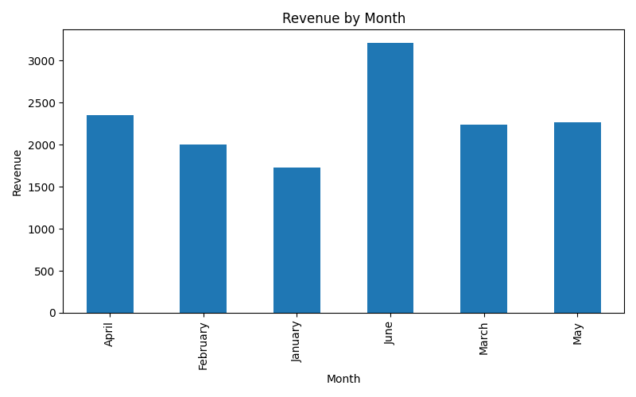
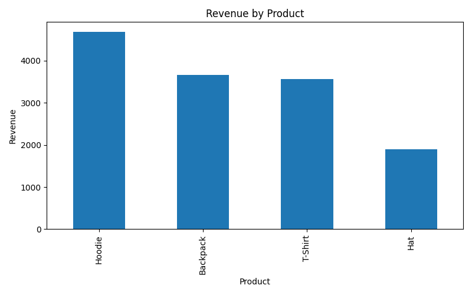
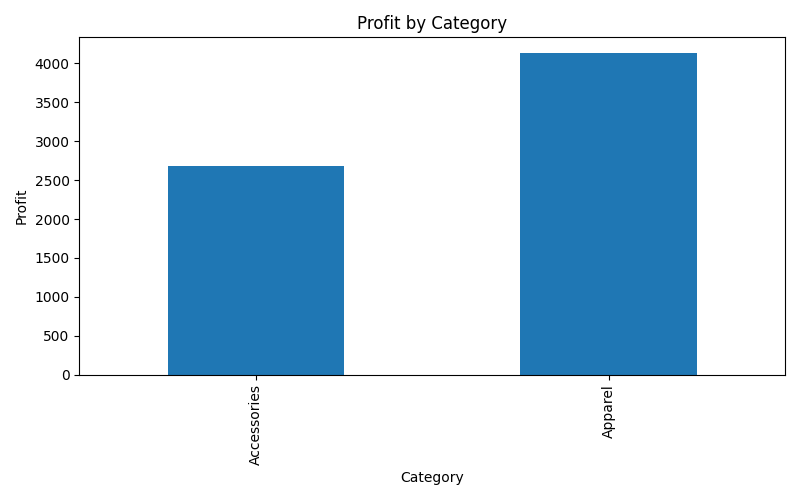
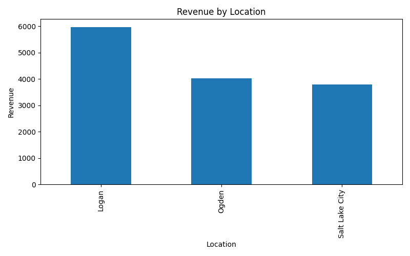

# Small Business Sales Dashboard

## Project Overview

This project analyzes sales data for a fictional small business. The goal is to identify revenue trends, top-selling products, profitable categories, and strong sales locations.

## Business Problem

Small businesses often collect sales data but do not always know how to turn that data into useful decisions. This dashboard helps answer:

- Which products generate the most revenue?
- Which months have the strongest sales?
- Which categories are most profitable?
- Which locations perform the best?

## Tools Used

- Python
- Pandas
- Matplotlib
- VS Code
- GitHub

## Key Findings

- Total revenue was $13,794.
- Total profit was $6,808.
- Hoodies generated the most revenue.
- Logan was the top location by revenue.

## Visualizations

### Revenue by Month


### Revenue by Product


### Profit by Category


### Revenue by Location


## How to Run This Project

```bash
pip install -r requirements.txt
python sales_analysis.py